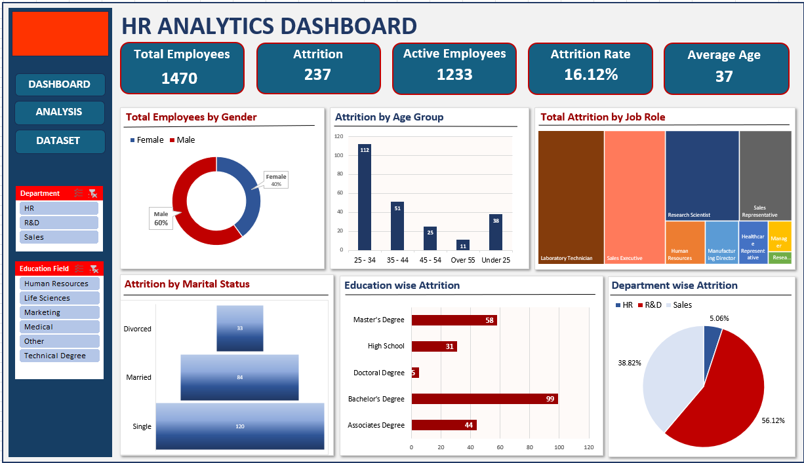

<h1 align="center">📊 HR Analytics Dashboard using Excel</h1>

  A professional Business Intelligence dashboard built with Microsoft Excel to analyze employee attrition, workforce demographics, and HR performance metrics.

  
  
  
  

  

---

<h2>📌 Project Overview</h2>

This <b>HR Analytics Dashboard</b> is an interactive Excel-based analytics project designed to help HR teams and business stakeholders understand workforce trends, monitor employee attrition, and make data-driven decisions.

The dashboard transforms raw HR data into clear, meaningful, and actionable insights using <b>Pivot Tables, Pivot Charts, KPI Cards, Slicers, Excel Formulas, Conditional Formatting, and Data Visualization techniques</b>.

---

<h2>❗ Business Problem</h2>

Organizations often struggle to track employee attrition, workforce distribution, and department-level performance due to scattered HR data and static reporting systems.

This project solves the problem by creating a centralized dashboard that allows stakeholders to quickly identify attrition patterns, high-risk employee segments, and key areas for improving retention.

---

<h2>🎯 Project Objectives</h2>

<ul>
  <li>Analyze employee attrition trends</li>
  <li>Monitor total employees, active employees, and attrition rate</li>
  <li>Identify high-risk departments and job roles</li>
  <li>Study workforce demographics by age, gender, education, and marital status</li>
  <li>Support strategic HR planning and employee retention decisions</li>
</ul>

---

<h2>📊 Dashboard Preview</h2>

  

---

<h2>📈 Key Performance Indicators</h2>

<table>
  <tr>
    <th>KPI</th>
    <th>Value</th>
  </tr>
  <tr>
    <td>Total Employees</td>
    <td>1470</td>
  </tr>
  <tr>
    <td>Attrition</td>
    <td>237</td>
  </tr>
  <tr>
    <td>Active Employees</td>
    <td>1233</td>
  </tr>
  <tr>
    <td>Attrition Rate</td>
    <td>16.12%</td>
  </tr>
  <tr>
    <td>Average Age</td>
    <td>37</td>
  </tr>
</table>

---

<h2>🧩 Dashboard Features</h2>

<ul>
  <li>Interactive HR Analytics Dashboard</li>
  <li>KPI Cards for quick business summary</li>
  <li>Department-wise attrition analysis</li>
  <li>Job role-based attrition insights</li>
  <li>Gender distribution analysis</li>
  <li>Age group-wise attrition tracking</li>
  <li>Education-wise attrition breakdown</li>
  <li>Marital status-based employee analysis</li>
  <li>Dynamic filtering using slicers</li>
  <li>Clean and professional dashboard design</li>
</ul>

---

<h2>⚙️ Project Workflow</h2>

<pre>
Raw HR Dataset
      ↓
Data Cleaning & Formatting
      ↓
Data Transformation
      ↓
Pivot Table Analysis
      ↓
KPI Calculation
      ↓
Dashboard Visualization
      ↓
Business Insights & Recommendations
</pre>

---

<h2>🛠️ Tools & Technologies Used</h2>

<ul>
  <li>Microsoft Excel</li>
  <li>Pivot Tables</li>
  <li>Pivot Charts</li>
  <li>Slicers</li>
  <li>Excel Formulas</li>
  <li>Conditional Formatting</li>
  <li>Data Cleaning</li>
  <li>Data Visualization</li>
  <li>Business Intelligence Reporting</li>
</ul>

---

<h2>🔍 Key Business Insights</h2>

<ul>
  <li>The highest attrition occurs in the <b>25–34 age group</b>.</li>
  <li>The <b>R&D department</b> shows the highest employee attrition.</li>
  <li><b>Single employees</b> have higher turnover compared to married and divorced employees.</li>
  <li><b>Bachelor’s degree holders</b> contribute the highest attrition count.</li>
  <li>Technical and operational roles show higher attrition risk.</li>
</ul>

---

<h2>💼 Business Impact</h2>

<ul>
  <li>Improves workforce visibility</li>
  <li>Helps HR teams identify attrition hotspots</li>
  <li>Supports strategic workforce planning</li>
  <li>Reduces manual reporting efforts</li>
  <li>Improves employee retention strategies</li>
  <li>Enables faster and data-driven HR decision-making</li>
</ul>

---

<h2>🚀 Skills Demonstrated</h2>

<ul>
  <li>Data Analytics</li>
  <li>HR Analytics</li>
  <li>Microsoft Excel Dashboarding</li>
  <li>Data Cleaning & Transformation</li>
  <li>Pivot Table Analysis</li>
  <li>Data Visualization</li>
  <li>KPI Reporting</li>
  <li>Business Intelligence</li>
  <li>Insight Generation</li>
</ul>

---

<h2>📂 Project Structure</h2>

<pre>
HR-Analytics-Dashboard
│
├── Dataset.xlsx
├── HR_Analytics_Dashboard.xlsx
├── dashboard.png
├── Problem_Statement.pdf
├── Final_Report.pdf
└── README.md
</pre>

---

<h2>📁 Project Files</h2>

<ul>
  <li><b>Dataset.xlsx</b> - HR dataset used for analysis</li>
  <li><b>HR_Analytics_Dashboard.xlsx</b> - Final interactive Excel dashboard</li>
  <li><b>dashboard.png</b> - Dashboard preview image</li>
  <li><b>Problem_Statement.pdf</b> - Detailed project problem statement</li>
  <li><b>Final_Report.pdf</b> - Stakeholder-ready final report</li>
</ul>

---

<h2>✅ Final Conclusion</h2>

This HR Analytics Dashboard demonstrates how Microsoft Excel can be used as a powerful Business Intelligence tool to convert raw employee data into meaningful insights.

The project helps organizations monitor attrition, understand workforce behavior, improve HR planning, and make better employee retention decisions.

It is a complete end-to-end data analytics project covering data cleaning, analysis, dashboard creation, business insights, and stakeholder reporting.

---

<h2>👨‍💻 Author</h2>

<b>Kuldeep Rathore</b> 
Data Analytics | AI/ML | Business Intelligence Enthusiast

<a href="https://www.linkedin.com/in/kuldeeprathore9440/">Connect with me on LinkedIn</a>

---

<h2>⭐ Support</h2>

If you found this project useful, please consider giving this repository a ⭐ on GitHub.

